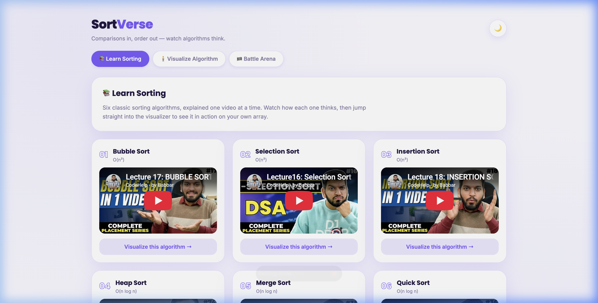
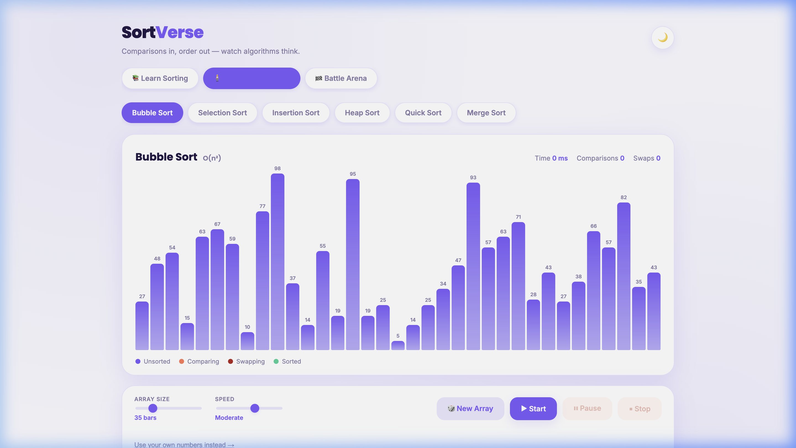
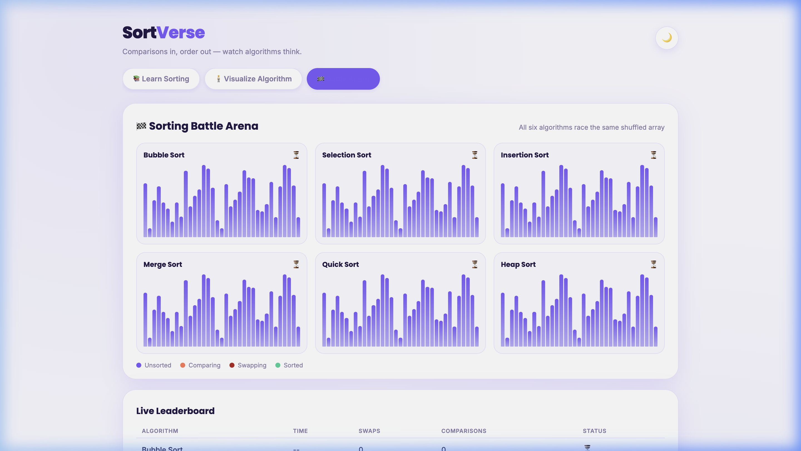
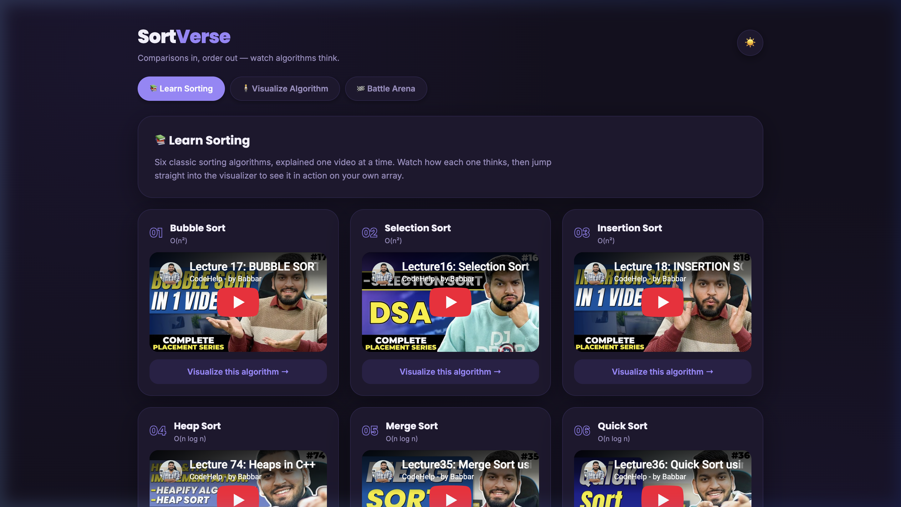

<p align="center">
  
  
  
  
</p>

<h1 align="center">
  🌀 SortVerse
</h1>

<p align="center">
  <b>Comparisons in, order out — watch algorithms think.</b>
</p>

<p align="center">
  <a href="https://sortverse.vercel.app">🔗 Live Demo</a> &nbsp;·&nbsp;
  <a href="#-features">✨ Features</a> &nbsp;·&nbsp;
  <a href="#-algorithms">🧮 Algorithms</a> &nbsp;·&nbsp;
  <a href="#-getting-started">🚀 Getting Started</a>
</p>

---

## 💡 What is SortVerse?

Ever stared at sorting algorithm pseudocode and thought *"cool, but what does it actually DO?"*

**SortVerse** turns that confusion into clarity. It's an interactive sorting algorithm visualizer that lets you **watch** algorithms think — bar by bar, comparison by comparison, swap by swap. No hand-wavy explanations. Just colorful bars doing their thing while you sit back and go *"ohhhh, so THAT'S how merge sort works."*

Whether you're a CS student cramming for exams, a self-taught developer filling in the fundamentals, or just someone who finds watching bars rearrange themselves oddly satisfying — SortVerse has you covered.

---

## 📸 Screenshots

<details>
<summary><b>📚 Learn Mode</b> — Video tutorials + one-click visualize</summary>
<br>

</details>

<details open>
<summary><b>🧍 Visualizer Mode</b> — Single algorithm deep-dive</summary>
<br>

</details>

<details>
<summary><b>🏁 Battle Arena</b> — All six algorithms race head-to-head</summary>
<br>

</details>

<details>
<summary><b>🌙 Dark Mode</b> — Easy on the eyes, hard on the algorithms</summary>
<br>

</details>

---

## ✨ Features

| Feature | Description |
|---|---|
| 📚 **Learn Mode** | Curated YouTube tutorials for each algorithm with a "Visualize this →" button that drops you straight into the action |
| 🧍 **Single Visualizer** | Pick an algorithm, tweak the array size & speed, and watch it sort in real-time with color-coded bars |
| 🏁 **Battle Arena** | All 6 algorithms race the **same shuffled array** simultaneously — with a live leaderboard tracking time, swaps & comparisons |
| 📊 **Progress Chart** | SVG line chart showing how comparisons and swaps accumulate over time |
| 🧠 **Complexity Analysis** | After each sort, see best/avg/worst case complexities with a verdict on how your run measured up |
| 🎲 **Random & Custom Arrays** | Generate random arrays or type your own comma-separated values |
| ⏸️ **Pause / Resume / Stop** | Full playback control — pause mid-sort, resume, or kill it entirely |
| 🌙 **Dark Mode** | One-click theme toggle that doesn't reset your sort state |
| 📱 **Responsive** | Works on desktop, tablet, and mobile screens |

---

## 🧮 Algorithms

SortVerse visualizes **6 classic sorting algorithms** — from the humble bubble to the mighty quicksort:

| # | Algorithm | Best | Average | Worst | Space | Vibe |
|:-:|-----------|:----:|:-------:|:-----:|:-----:|------|
| 01 | **Bubble Sort** | O(n) | O(n²) | O(n²) | O(1) | The friendly neighbor who checks every pair twice |
| 02 | **Selection Sort** | O(n²) | O(n²) | O(n²) | O(1) | The perfectionist who always picks the smallest first |
| 03 | **Insertion Sort** | O(n) | O(n²) | O(n²) | O(1) | The card player who keeps their hand sorted |
| 04 | **Heap Sort** | O(n log n) | O(n log n) | O(n log n) | O(1) | The tree-hugger with guaranteed performance |
| 05 | **Merge Sort** | O(n log n) | O(n log n) | O(n log n) | O(n) | The divide-and-conquer diplomat |
| 06 | **Quick Sort** | O(n log n) | O(n log n) | O(n²) | O(log n) | The speedster who occasionally trips |

---

## 🎨 Color Legend

While watching the visualizer, the bars change color to show what's happening under the hood:

| Color | Meaning |
|:-----:|---------|
| 🟣 **Purple** | Unsorted — just vibing, waiting their turn |
| 🟠 **Orange** | Comparing — "are you bigger than me?" |
| 🔴 **Red** | Swapping — the ol' switcheroo |
| 🟢 **Green** | Sorted — locked in, done deal ✅ |

---

## 🚀 Getting Started

SortVerse is a **zero-dependency** static site. No npm install, no build step, no frameworks. Just HTML, CSS, and JavaScript doing what they do best.

### Run it locally

```bash
# Clone the repo
git clone https://github.com/ayush7AM/SortVerse.git

# Open it
cd SortVerse
open index.html        # macOS
# or
start index.html       # Windows
# or
xdg-open index.html    # Linux
```

Or just use a live server:

```bash
# With Python
python3 -m http.server 8080

# With Node
npx serve .
```

### Deploy your own

[](https://vercel.com/new/clone?repository-url=https://github.com/ayush7AM/SortVerse)

---

## 🏗️ Project Structure

```
SortVerse/
├── index.html          # The entire UI — three views, one page
├── style.css           # Design system with light/dark themes
├── script.js           # All 6 sorting algorithms + arena logic
├── screenshots/        # README screenshots
└── README.md           # You are here 👋
```

---

## 🤝 Contributing

Found a bug? Want to add a 7th algorithm? Have an idea that would make this even cooler?

1. **Fork** the repo
2. **Create** your feature branch → `git checkout -b feat/radix-sort`
3. **Commit** your changes → `git commit -m "Add radix sort visualization"`
4. **Push** to the branch → `git push origin feat/radix-sort`
5. **Open a Pull Request** 🎉

All contributions are welcome — from typo fixes to entirely new features.

---

## 📄 License

This project is open source and available under the [MIT License](LICENSE).

---

<p align="center">
  <b>Built with 💜 and way too many comparisons.</b>
  <br><br>
  <a href="https://sortverse.vercel.app">
    
  </a>
</p>
